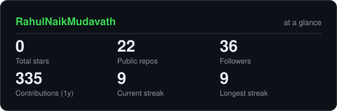
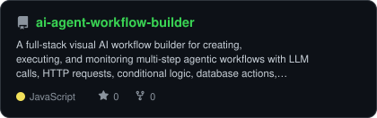
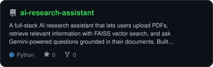
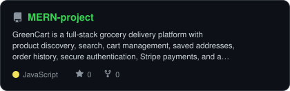
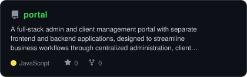

<div align="center">

<!-- PORTRAIT - generated by scripts/dotify.py from assets/jacket.png.
     Colour mode, so one file serves both GitHub themes. Regenerate with:
       python scripts/dotify.py assets/jacket.png -o assets/portrait \
         --cols 100 --equalize --detail 0.5 --color -->


<br>

<!-- NAME / TAGLINE - animated typing -->
<a href="https://github.com/RahulNaikMudavath">
  
</a>

<br>

<!-- SOCIALS -->
<a href="https://linkedin.com/in/rahul-naik-m"></a>
<a href="mailto:rahulnaikmudavath47@gmail.com"></a>


</div>

---

## `~/` whoami

```console
$ cat about.txt
```

Hi, I'm **Rahul Naik Mudavath**. I build things that sit somewhere between machine learning and the web,
and I solve problems for fun when neither of those is cooperating.

- Currently building **[ai-agent-workflow-builder](https://github.com/RahulNaikMudavath/ai-agent-workflow-builder)** and **[ai-research-assistant](https://github.com/RahulNaikMudavath/ai-research-assistant)**
- Learning **React + Machine Learning + Agentic AI**
- Fun fact: **I started coding seriously because I wanted to build things I wished existed.**

<br>

<div align="center">

## `~/` toolbox


</div>

---

<div align="center">

## `~/` skill radar

<table>
<tr>
<td width="50%" align="center" valign="middle">

<!-- Self-rated radar - edit assets/skills.json, the workflow redraws it -->
<picture>
  <source media="(prefers-color-scheme: dark)"  srcset="assets/radar-dark.svg">
  <source media="(prefers-color-scheme: light)" srcset="assets/radar-light.svg">
  
</picture>

</td>
<td width="50%" align="center" valign="middle">

<!-- Live radar built from real language byte counts across your repos -->
<picture>
  <source media="(prefers-color-scheme: dark)"  srcset="assets/radar-langs-dark.svg">
  <source media="(prefers-color-scheme: light)" srcset="assets/radar-langs-light.svg">
  
</picture>

</td>
</tr>
</table>

</div>

---

<div align="center">

## `~/` contribution calendar

<!-- 3D isometric calendar, regenerated every 6h by .github/workflows/metrics.yml -->


<br><br>

<!-- Snake eats the contribution graph - .github/workflows/snake.yml -->
<picture>
  <source media="(prefers-color-scheme: dark)"  srcset="https://raw.githubusercontent.com/RahulNaikMudavath/RahulNaikMudavath/output/snake-dark.svg">
  <source media="(prefers-color-scheme: light)" srcset="https://raw.githubusercontent.com/RahulNaikMudavath/RahulNaikMudavath/output/snake.svg">
  
</picture>

</div>

---

<div align="center">

## `~/` the numbers

<!-- Generated by scripts/cards.py into this repo. Deliberately NOT
     github-readme-stats / streak-stats / github-profile-trophy: those are
     shared public instances that go down and take the whole section with them. -->
<picture>
  <source media="(prefers-color-scheme: dark)"  srcset="assets/card-stats-dark.svg">
  <source media="(prefers-color-scheme: light)" srcset="assets/card-stats-light.svg">
  
</picture>

<br>


<br><br>


</div>

---

<div align="center">

## `~/` selected work

<!-- Cards generated by scripts/cards.py from assets/projects.json.
     Stars, forks and language are pulled live from the API on every run. -->
<table>
<tr>
<td width="50%">
  <a href="https://github.com/RahulNaikMudavath/ai-agent-workflow-builder">
    <picture>
      <source media="(prefers-color-scheme: dark)"  srcset="assets/card-ai-agent-workflow-builder-dark.svg">
      <source media="(prefers-color-scheme: light)" srcset="assets/card-ai-agent-workflow-builder-light.svg">
      
    </picture>
  </a>
</td>
<td width="50%">
  <a href="https://github.com/RahulNaikMudavath/ai-research-assistant">
    <picture>
      <source media="(prefers-color-scheme: dark)"  srcset="assets/card-ai-research-assistant-dark.svg">
      <source media="(prefers-color-scheme: light)" srcset="assets/card-ai-research-assistant-light.svg">
      
    </picture>
  </a>
</td>
</tr>
<tr>
<td width="50%">
  <a href="https://github.com/RahulNaikMudavath/MERN-project">
    <picture>
      <source media="(prefers-color-scheme: dark)"  srcset="assets/card-MERN-project-dark.svg">
      <source media="(prefers-color-scheme: light)" srcset="assets/card-MERN-project-light.svg">
      
    </picture>
  </a>
</td>
<td width="50%">
  <a href="https://github.com/RahulNaikMudavath/portal">
    <picture>
      <source media="(prefers-color-scheme: dark)"  srcset="assets/card-portal-dark.svg">
      <source media="(prefers-color-scheme: light)" srcset="assets/card-portal-light.svg">
      
    </picture>
  </a>
</td>
</tr>
</table>

<sub>

| project | live | stack |
|---|---|---|
| **[ai-agent-workflow-builder](https://github.com/RahulNaikMudavath/ai-agent-workflow-builder)** | - | `React` `Node.js` `LLMs` `N8N` |
| **[ai-research-assistant](https://github.com/RahulNaikMudavath/ai-research-assistant)** | - | `FastAPI` `React` `FAISS` `Gemini` |
| **[MERN-project](https://github.com/RahulNaikMudavath/MERN-project)** | - | `MongoDB` `Express` `React` `Node` |
| **[portal](https://github.com/RahulNaikMudavath/portal)** | - | `React` `Node.js` `Express` |
| **[Dayflow-HRMS](https://github.com/RahulNaikMudavath/Dayflow---Human-Resource-Management-System-)** | - | `React` `TypeScript` `Node.js` |
| **[DocuMind](https://github.com/RahulNaikMudavath/computer-vision-and-nlp-project)** | - | `Python` `PyTorch` `NLP` `OCR` |
| **[weather-data-etl](https://github.com/RahulNaikMudavath/weather-data-etl)** | - | `Python` `ETL` `APIs` |

</sub>

</div>

---

<div align="center">

<sub>`01110100 01101000 01100001 01101110 01101011 01110011 00100000 01100110 01101111 01110010 00100000 01110011 01100011 01110010 01101111 01101100 01101100 01101001 01101110 01100111`</sub>

</div>
